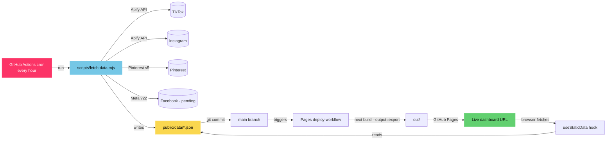
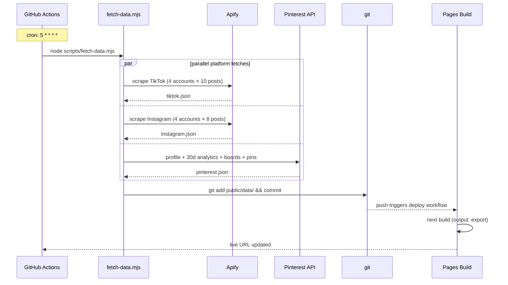

# SimpleNursing Social Intelligence Dashboard

> **Live link:** _will populate once GitHub Pages is enabled_ → `https://samcolibri.github.io/<repo>/pulse/`

Real-time, public, hourly-refreshed social analytics dashboard for the **SimpleNursing** brand. Covers **TikTok, Instagram, Facebook, Pinterest** across owned + competitor accounts. Built to replace the manual `Social Performance Tracker (2026).xlsx` workflow with live, agent-grade intelligence.

   

---

## What this is

| Surface | Source | Status |
|--------|--------|--------|
| **TikTok** owned + 3 competitors | Apify `clockworks~free-tiktok-scraper` | ✅ Live |
| **Instagram** owned + 3 competitors | Apify `apify~instagram-profile-scraper` | ✅ Live |
| **Pinterest** owned | Pinterest API v5 (direct token) | ✅ Live |
| **Facebook** owned | Meta Graph API v22 | ⚠️ Pending Business App ID |
| **Trending hashtags** (8 nursing tags) | Apify hashtag scraper | ✅ Live (best-effort) |
| **YoY 2026 baseline** (Jan-Apr) | Excel tracker | ✅ Embedded |

Every hour, a GitHub Action runs `scripts/fetch-data.mjs`, writes JSON to `public/data/`, commits it, and triggers a Pages rebuild. The dashboard reads those static JSON files — no server, no cold starts, no API keys leaving the repo's encrypted secrets.

---

## Architecture



### Data flow per refresh cycle



### Repo layout

```
.
├── app/
│   ├── pulse/page.jsx        ← unified 4-platform dashboard (main view)
│   ├── posts/                ← per-post browser
│   ├── competitors/          ← deep competitor view
│   ├── trends/               ← hashtag + velocity insights
│   ├── recommendations/      ← AI content suggestions
│   └── settings/             ← connection status + config
├── lib/
│   ├── pinterest.ts          ← Pinterest API v5 client
│   ├── apify.ts              ← Apify actor wrappers
│   └── data.ts               ← Excel-derived baseline seed data
├── scripts/
│   └── fetch-data.mjs        ← cron-runnable data fetcher
├── public/data/              ← refreshed JSON (committed by Action)
│   ├── tiktok.json
│   ├── instagram.json
│   ├── pinterest.json
│   ├── hashtags.json
│   ├── meta.json
│   └── last-updated.json
├── .github/workflows/
│   ├── refresh-data.yml      ← hourly cron, commits JSON
│   └── deploy.yml            ← builds + publishes to Pages
└── next.config.ts            ← output: 'export', basePath dynamic
```

---

## Local development

### Prerequisites
- Node.js 22+
- Apify account ([apify.com](https://apify.com), free tier ~$5/mo credits is enough)
- Pinterest API v5 access token (long-lived; not OAuth needed)

### Setup
```bash
git clone https://github.com/samcolibri/<repo>.git
cd <repo>
npm ci
cp .env.example .env.local  # then fill in your tokens
npm run refresh              # pulls fresh data into public/data/
npm run dev                  # http://localhost:3000/pulse
```

### Environment variables

| Variable | Required | Where used |
|----------|----------|------------|
| `APIFY_TOKEN` | ✅ | TikTok + Instagram + Facebook scraping |
| `PINTEREST_ACCESS_TOKEN` | ✅ | Pinterest API v5 |
| `META_PAGE_ACCESS_TOKEN` | ❌ | Owned FB Page insights (when ready) |
| `IG_BUSINESS_ACCOUNT_ID` | ❌ | Owned IG Business insights |
| `META_PAGE_ID` | ❌ | Facebook Page ID |
| `ANTHROPIC_API_KEY` | ❌ | AI recommendation generation |

**Never commit `.env.local`.** It is gitignored. In CI, all values come from encrypted GitHub repository secrets.

### Manually refresh data
```bash
npm run refresh   # 60-90 seconds, hits all platform APIs
```

### Build static export
```bash
npm run export    # writes ./out/
```

---

## Deployment to GitHub Pages

The repo deploys automatically on every push to `main` via `.github/workflows/deploy.yml`. To set up Pages on a fresh repo:

1. **Add repository secrets** (Settings → Secrets and variables → Actions):
   - `APIFY_TOKEN`
   - `PINTEREST_ACCESS_TOKEN`
   - (Optional) `META_PAGE_ACCESS_TOKEN`, `IG_BUSINESS_ACCOUNT_ID`, `META_PAGE_ID`

2. **Enable Pages** (Settings → Pages):
   - Source: **GitHub Actions**

3. **First deploy:**
   - Push to `main` (or trigger `deploy.yml` manually)
   - First refresh: trigger `refresh-data.yml` manually to populate `public/data/`

4. **Hourly refresh** runs automatically once the workflow is on `main`.

---

## How the Excel was rebuilt 10x

The original `Social Performance Tracker (2026).xlsx` had 12 sheets covering:
- IG / FB / TT monthly hand-typed metrics
- YouTube weekly + daily
- Podcast (Buzzsprout/Spotify/Apple)
- 2025↔2026 YoY comparisons
- 2026 budget vs spend

What this dashboard does on top of it:

| Excel limitation | Dashboard upgrade |
|------------------|------------------|
| Manual monthly data entry | Hourly auto-scrape via Apify + Pinterest API |
| Owned accounts only | Owned **+ 6 direct competitors** tracked in real-time |
| No per-post breakdown | Top 8 viral posts ranked across all accounts every hour |
| No topic intelligence | Auto-clusters viral content into NCLEX/ECG/Pharm/etc topic buckets |
| Static snapshots | Live followers/views/engagement (1.2M+ TT followers tracked live) |
| Single user (Excel file) | Public dashboard, anyone with the link can view |
| No alerting | Connection status + last-refresh timestamp visible at all times |

---

## Security

- `.env.local` is **gitignored**; never committed
- All production secrets live in **GitHub repository secrets** (encrypted at rest)
- The repo contains **zero hardcoded credentials** (verified via `git log -S` scan)
- Pinterest token can be revoked at [developers.pinterest.com](https://developers.pinterest.com) at any time
- Apify token can be rotated at [console.apify.com/account/integrations](https://console.apify.com/account/integrations)
- **Platform passwords (IG/TT/Pinterest login passwords) were shared in chat during initial setup and should be considered leaked → rotate them.** OAuth tokens only from here on.

---

## Stack

- **Next.js 16.2.6** App Router + static export
- **React 19.2** with TanStack Query for client cache
- **Tailwind CSS v4** dark mode default
- **Recharts** for line/bar/area charts
- **Apify** as the universal scraper (cheaper + faster than direct platform APIs for IG/TT in 2026)
- **Pinterest API v5** direct integration
- **GitHub Actions** for cron + Pages deploy
- **GitHub Pages** for free public hosting

---

## Roadmap

- [ ] Wire Meta Graph API for owned FB/IG Business insights once App ID is approved
- [ ] Add YouTube Data API v3 channel + Shorts metrics
- [ ] Add Podcast metrics (Buzzsprout API + Spotify API)
- [ ] AI-generated content recommendations via Claude API (`ANTHROPIC_API_KEY` ready)
- [ ] Slack notification on competitor viral threshold breach
- [ ] Per-post conversion attribution (UTM → GA4 → Shopify)

---

Built for Sam @ SimpleNursing. Pull requests welcome.

🤖 Co-built with Claude Code
